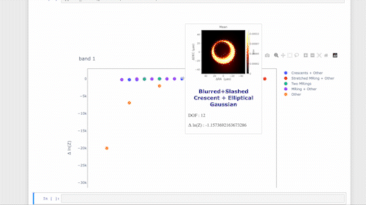

# m872018VisibilityDomainResults
Summary dashboard of the results from the 2018 M87 visibility domain data analysis

## Summary
Geometric modeling played a key role in feature extraction from the 2017 M87* data sets. The most statistically preferred model was found through a log likelihood comparison to be a family of crescent models . The EHT has since introduced an MRing family of models which were shown to be statistically more favored than the crescent family of models through a similar comparison using the 2017 SgrA* data. Here we perform a model comparison on the 2018 M87* data using a more robust log evidence metric. We include crescent models, MRing models, double MRing models, and Stretched MRing models and conclude that the statistically preferred models are the family of Stretched MRing models with Gaussians.

## Data
* 2018 M87 Pre L2 data that has been calibrated through the HOPS pipeline.
* bands 1 through 4
* experiment number 3644
* Flagged 0 baselines
* 1% Systematic Noise
* Scan Averaged Data
Note: Bands 1 and 2 are missing baselines that include GLT.

## Methodology
We performed a log Evidence comparison between multiple geometric models. The log Evidence was calculated with dynesty.py's implementation of nested sampling which we ran with 10,000 live points. The priors used from the distribution were constructed iteratively from a list of prior 'primitives' (See Priors below for a list of these primitives). For example, the τg primitive is a uniform distribution from 0-1. This primitive is used to represent an Elliptical Gaussian's fractional stretch. A model with two Elliptical Gaussian would have a prior with two τg prior primitives that both represent uniform distributions from 0-1.

Nested sampling outputs a list of samples from the posterior and their corresponding weights. We utilized this information to calculate an intensity image of the Maximum a-Posteriori (M.A.P.), Mean and STD for each model. We also produce estimates of the posterior with this information and produce corner plots of the associated model parameters. The resulting analysis has been neatly packaged into an interactive JuPyteR notebook.
